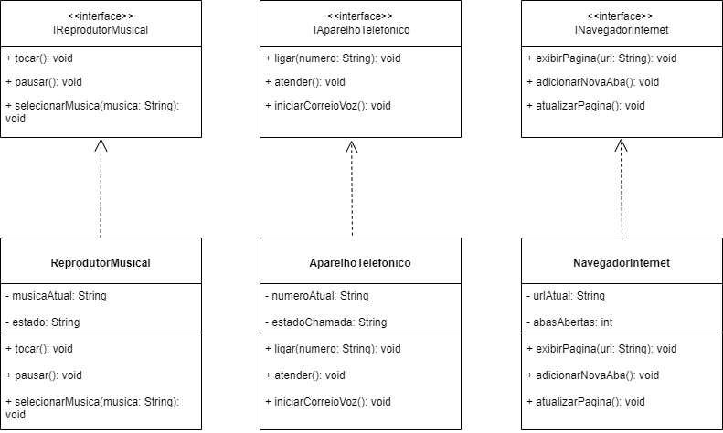

# iPhone Project

Este projeto implementa um componente iPhone com funcionalidades de Reprodutor Musical, Aparelho Telefônico e Navegador na Internet.

## Diagrama de Classes

## Funcionalidades

### Reprodutor Musical
- `tocar()`
- `pausar()`
- `selecionarMusica(String musica)`

### Aparelho Telefônico
- `ligar(String numero)`
- `atender()`
- `iniciarCorreioVoz()`

### Navegador na Internet
- `exibirPagina(String url)`
- `adicionarNovaAba()`
- `atualizarPagina()`
